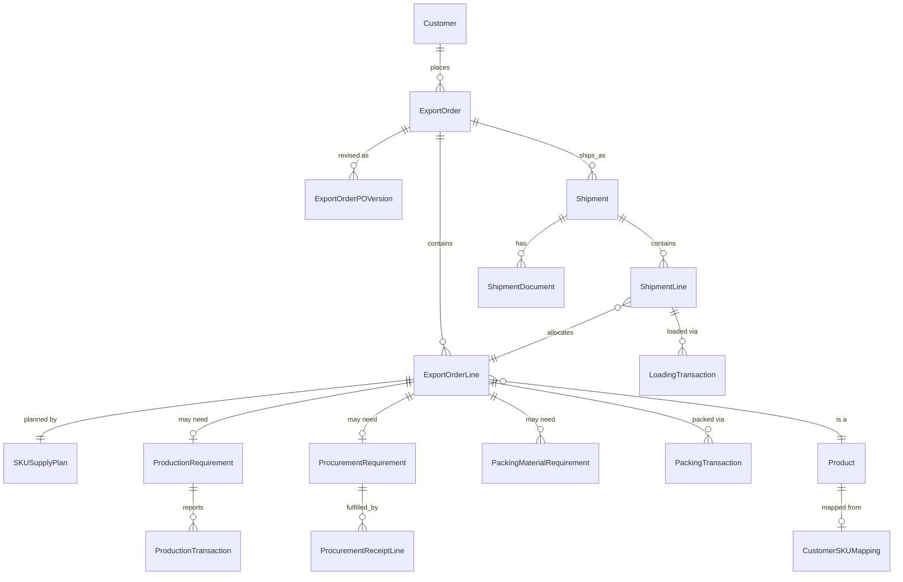

# Export Order Management — Domain Model (V1)

Implementation-oriented breakdown of `docs/modules/export-orders/functional-spec.md` into entities, grouped by which Django app owns them. Companion docs: [business-rules.md](business-rules.md), [ui-spec.md](ui-spec.md), [api-spec.md](api-spec.md), [acceptance-tests.md](acceptance-tests.md).

Per [`CLAUDE.md`](../../../CLAUDE.md): backend owns business logic, modules stay clearly separated, shared capabilities live in reusable apps, and abstraction is not added ahead of a demonstrated need. This doc is where that separation gets decided concretely for Export Order Management.

## 1. App boundary map

| Capability | Owning app | Reusable beyond Export Orders? |
|---|---|---|
| Organization/Company | `core` | Yes — placeholder only, see §6.1 |
| User, authentication | `accounts` | Yes |
| Employee, Team/Department | `accounts` | Yes |
| Roles & permissions (Django Groups) | `accounts` | Yes |
| Customer, Customer Address | `customers` | Yes |
| Product/SKU (incl. packing materials) | `products` | Yes |
| Vendor | `vendors` | Yes |
| Attachment | `attachments` | Yes |
| Comment | `comments` | Yes |
| Audit trail, Date Revision | `audit` | Yes |
| Notification | `notifications` | Yes |
| Customer↔SKU mapping & packing config | `products` (`CustomerSKUMapping`) | Yes — built |
| Export Order, PO versions, Order Lines | `export_orders` | No |
| SKU Supply Plan, Production/Procurement/Packing-material Requirements | `export_orders` | No |
| Production Transactions, Procurement Receipts, Packing Transactions | `export_orders` | No |
| Shipment, Shipment Line, Loading, Shipment Documents | `export_orders` | No |

**`export_orders` stays a single Django app for V1.** Internally it's organized by sub-domain (`models/order.py`, `models/planning.py`, `models/production.py`, `models/procurement.py`, `models/packing.py`, `models/shipment.py`) rather than split into separate apps now — none of these concepts are consumed outside Export Order Management yet, so splitting them would be the premature abstraction `CLAUDE.md` warns against. When Production/Procurement/Packing become real modules, their *requirement/transaction* rows here are what gets replaced by data sourced from those modules (the `source` field carries this transition, see [business-rules.md](business-rules.md)) — this app doesn't need to be torn apart to make that happen.

## 2. Reusable (platform) entities

### 2.1 `core` — Organization

| Field | Type | Notes |
|---|---|---|
| id | PK | |
| name | Char | |

V1 seeds exactly one row and nothing references it yet. Included now purely so a future multi-site/multi-company need doesn't force a retrofit — see open question §6.1. No management UI in V1.

### 2.2 `accounts` — User, Employee, Team

| Entity | Key fields | Notes |
|---|---|---|
| User | username/employee_code, password, is_active | AUTH_USER_MODEL. Login identifier is employee code, not email. |
| Employee | user (1:1, nullable), employee_code, full_name, department | Minimal; HR module extends later. |
| Team | name, function (`Export`, `Production`, `Procurement`, `Packing`, `Logistics`) | Backs `Responsible Team` fields used throughout planning (spec §14, §16, §25). |
| Role | Django Group | Coordinator, Production Coordinator, Procurement Coordinator, Packing Coordinator, Logistics Coordinator, Manager/Admin — see [ui-spec.md](ui-spec.md) for the permission matrix per role. |

### 2.3 `customers` — Customer, Customer Address

**Built** (`backend/apps/customers/`), revamped per the business's "Customers - screen" field spec (`Export order manager - ChatGPT Qs.xlsx`, tab "Customers - screen") — materially different from the original design table below, which predates that spec.

| Entity | Field | Deviation from the design table |
|---|---|---|
| Customer | code, name | unchanged |
| Customer | main_poc | new — the spec's "Main PoC" |
| Customer | emails, phone_numbers | new — Postgres `ArrayField`s (list of strings), not a child table; the spec's "Email IDs" (plural) and "Phone number" both became multi-value |
| Customer | internal_coordinator | new — FK to `accounts.Employee`, nullable; same shape as `ExportOrder.export_coordinator` |
| Customer | is_active | unchanged (kept though the spec doesn't list it — existing deactivation mechanism, no delete route) |
| Customer | ~~country~~, ~~currency~~, ~~default Incoterm~~, ~~default payment terms~~ | **removed** — never built beyond `country`/`currency`, and neither is in the spec; nothing else in the codebase read them (`ExportOrder` carries its own independent `country`/`currency` per order) |
| CustomerAddress | address_type | `Billing` / `Shipping` / `Billing & Shipping` (was `Bill To`/`Ship To`/`Other`) — a `Billing & Shipping` address appears in both the Export Order Bill To and Ship To pickers |
| CustomerAddress | country, state | free-text, per the spec (shown as "Drop down" on the sheet, but no country/state reference data exists in this codebase — flagged as a gap, not built) |
| CustomerAddress | line1, line2, line3 | 3 address lines, per the spec (was 2) |
| CustomerAddress | pin | new name (was `postal_code`) — the spec's literal field name |
| CustomerAddress | ~~city~~ | **removed** — not in the spec's address field list |

### 2.4 `products` — Product/SKU

| Field | Type | Notes |
|---|---|---|
| internal_sku | Char, unique | |
| description | Char | |
| item_type | Enum(`FINISHED_GOOD`, `PACKING_MATERIAL`) | Not yet built — see §6.4. Note this is unrelated to the *built* `export_orders.PackingMaterialRequirement` (§3.6), which uses a fixed 4-value enum instead of a Product FK. |
| base_uom | Char | Always "Piece" for finished goods per spec §9. |
| available_qty | Integer | **Built** (`products.Product.available_qty`, default `0`) — narrower than this sketch: not a general-purpose stock field yet, only touched by the Loading workflow's stock-return reconciliation (`export_orders.ExportOrderLine.sync_stock_return()`, §3.8). Nothing else (packing, production, procurement) reads or writes it. The future Inventory module still owns the real version of this field. |
| active | Bool | |

### 2.5 `vendors` — Vendor

**Built** (`backend/apps/vendors/`) — matches the design table below, with one naming deviation: `is_active` (not the doc's literal `active`), matching `Team.is_active`/`Employee.is_active` naming elsewhere in the codebase. A read-only API (`ReadOnlyModelViewSet`, `IsAuthenticated`, filtered to `is_active=True`) mirrors `apps.accounts.Team`'s exact precedent — **admin-managed only, no create/edit UI**. A full vendor-management screen was out of scope for "minimal."

| Field | Type |
|---|---|
| code, name | Char |
| category | Char (free text or small enum — raw material / packing material / service) |
| active | Bool |

This supersedes the earlier architecture-doc call to scaffold Vendor and defer it to a future Procurement module — the functional spec's V1 master-data list explicitly requires a basic Vendor master now (Procurement Requirement and Receipts both reference it). Kept intentionally minimal: no approval workflow, no vendor rating, no commercial terms beyond what Procurement Requirement itself carries.

### 2.6 `attachments`, `comments` — generic capabilities

Both use `GenericForeignKey` (content_type, object_id) so any model can attach files or carry a discussion thread with one mixin, no new tables per module. Used on: Export Order (PO source document — see also PO Version below), Shipment Document (file itself), and the Export Order "Activity/History" tab (comment thread).

Note: most `Remarks` fields called out in the functional spec (Export Order Line, SKU Supply Plan, Production Requirement, Production Transaction, Procurement Requirement, Procurement Receipt, Packing Transaction, Shipment, Shipment Document) are **plain text fields on those records**, not the generic Comment thread — they're a single free-text note per record, not a multi-party discussion. The reusable `comments` app is for the Export Order-level discussion feed only.

### 2.7 `audit` — audit trail & date revision

| Mechanism | Shape | Used for |
|---|---|---|
| Field history | History table per tracked model (e.g. via `django-simple-history`), one line to opt in | Every transactional/requirement model in `export_orders`, plus Customer/Product/Vendor masters. Powers the "Activity/History" tab together with Comments. |
| `DateRevision` | Generic FK (record type/id), `date_field_name`, `previous_date`, `new_date`, `changed_by`, `changed_at`, `reason` | V1 scope is **Planned Ready Date only** (spec §37, explicit). Field history alone doesn't force a `reason` to be captured, which is why this exists as a separate mechanism rather than being folded into generic history. |

Every `export_orders` model also carries `created_by`/`created_at`/`updated_by`/`updated_at` via the shared `core.BaseModel` mixin (already established for the platform generally).

### 2.8 `notifications`

Standard in-app notification (recipient, message, related object via GenericForeignKey, is_read, created_at, action link) plus the `notify()` service function `export_orders` calls on the trigger events listed in the functional spec §57. See [business-rules.md](business-rules.md) for the trigger list.

---

## 3. Export Order-specific entities (`export_orders` app)

### 3.1 Order & PO

**Header + PO revision history + Lines are built** (`backend/apps/export_orders/models.py`). Everything downstream of Lines (§3.3–§3.8: planning, production, procurement, packing, shipment) is still design-only, not yet built.

The built `ExportOrder` model deviates from the design table below in a few places, each a deliberate scope call flagged (not silently made) when the slice was planned:

| Design field | Built as | Why |
|---|---|---|
| `proforma_invoice_reference` | Not built | Not in the literal field list the slice was scoped to; can be added later without migration risk. |
| `planned_ready_date` / `original_planned_ready_date` + `DateRevision` | Single `planned_container_ready_date` field, plain-editable, no `DateRevision` yet | Forcing a required-reason prompt on a header date field cut against the slice's "must feel lightweight" requirement. Deferred, not dropped — `DateRevision` (§2.7) still applies once built. |
| `coordinator` FK → User | `export_coordinator` FK → `accounts.Employee` | Consistent with the rest of the platform addressing people via Employee, not User, in business records. |
| `bill_to`, `ship_to` as FK → CustomerAddress, PO-version-scoped | Same FK, but a live reference — not snapshotted | If a `CustomerAddress` is edited later, already-created orders referencing it show the updated address. Unlike the `CustomerSKUMapping` snapshot rule (§3.2), this slice does not copy address text onto the order. Flagged as a known gap, same category of concern as the packing-config snapshot rule. |
| PO source document via generic `attachments` app | Plain `FileField` directly on `ExportOrderPOVersion` | The spec ties the document specifically to the PO version, not a general multi-object attachment collection. A `GenericForeignKey`-based Attachments app is deferred until a second consumer (e.g. Shipment Documents) actually needs it. |
| — | `customer` is locked after creation (not editable) | Reassigning an order to a different customer after creation isn't a real workflow. |
| — | No uniqueness constraint on `customer_po_number` | Spec doesn't call for one; customers could plausibly reuse their own numbering schemes across orders. |

**ExportOrder** (design intent — see deviations above for what's actually built)

| Field | Type | Notes |
|---|---|---|
| order_number | Char, unique | Generated, see numbering in [business-rules.md](business-rules.md). |
| customer | FK → Customer | |
| customer_po_number, customer_po_date | Char, Date | |
| proforma_invoice_reference | Char, nullable | |
| currency, country, destination_port | Char | |
| requested_shipment_date | Date | |
| planned_ready_date | Date | Current value; history via `DateRevision`. |
| original_planned_ready_date | Date | Set once at creation, never overwritten. |
| incoterm, payment_terms | Char | |
| bill_to, ship_to | FK → CustomerAddress | |
| coordinator | FK → User | |
| status | Enum — see [business-rules.md](business-rules.md) | |
| internal_remarks | Text | |
| customer_remarks | Text | Customer-portal-visible. |

**ExportOrderPOVersion** (built, matching this design apart from `document` being a plain `FileField` rather than an Attachment FK — see deviations above)

| Field | Type |
|---|---|
| export_order | FK |
| version_number | Integer |
| document | FK → Attachment |
| uploaded_by, uploaded_at | | 
| remarks | Text |
| is_current | Bool |

Append-only: revisions never overwrite a prior version's row; `is_current` moves forward. `ExportOrder` fields always reflect the current version's data at the header level; Order Lines are re-derived/updated against the new version per line (not modeled as a separate copy of every line per PO version — see open question §6.6). This re-derivation only applies once that PO-revision workflow is built — the current slice has no code path that re-derives lines from a new PO version yet.

**ExportOrderLine — built** (`backend/apps/export_orders/models.py`), scoped to capturing what was ordered and converting it to pieces. Deviations from the design table below:

| Design field | Built as | Why |
|---|---|---|
| `customer_ordered_qty` (Decimal), `customer_order_unit` | `original_customer_quantity` (`PositiveIntegerField`), `original_customer_unit` | Names align to the literal requirement wording ("Original Customer Quantity/Unit") and its "preserve the customer's original quantity and unit" framing. `Decimal` → `PositiveIntegerField` because pieces/pouches/cartons are inherently whole-count units — a deliberate refinement, not a silent change. |
| `customer_sku`, `customer_description` | `customer_sku_code`, `customer_description` | Aligned to `products.CustomerSKUMapping`'s existing field name for the same textual identity, instead of introducing a second name for the same concept. |
| `planned_ready_date`, `risk_status`, `line_status`, `remarks` | Not built | Supply-planning/tracking fields, out of scope for this slice — not in the literal field list it was scoped to, deferred to the future SKU Planning slice (ui-spec.md §5.2) the same way the header slice deferred `DateRevision`. |
| `pieces_per_pouch`/`pouches_per_carton` "copied... at order creation time" | Copied at creation **and** re-copied whenever `product` is later changed to a different value | Refines the wording to be precise about update semantics — correcting a line's Internal SKU must re-resolve its packing config, not leave it pointing at a stale mapping. Any other field edit (quantity, unit, description) leaves the existing snapshot untouched. |
| `required_pieces`/`required_pouches`/`required_cartons`: "Integer, computed" | Model `@property`s + read-only serializer fields, never stored | Mirrors `CustomerSKUMapping.pieces_per_carton` exactly (§3.2) — matches `CLAUDE.md`'s "derived, not stored or edited independently." |
| — | Not nested inside `ExportOrderSerializer` (unlike `po_versions`) | Up to 50 lines shouldn't load on every header fetch (list/detail/edit) when most views never need them — a dedicated `GET /export-orders/{id}/lines/` is the only way to fetch them, and that endpoint is deliberately unpaginated (api-spec.md). |
| — | No uniqueness constraint on `customer_sku_code` within an order | Matches the precedent of not enforcing `customer_po_number` uniqueness at the header level. |
| — | Full CRUD (including delete), no status-based lock | Matches how `ExportOrder` header editing itself isn't gated by status in this slice. |

**ExportOrderLine** (design intent — see deviations above for what's actually built)

| Field | Type | Notes |
|---|---|---|
| export_order | FK | |
| line_number | Integer | |
| customer_sku, customer_description | Char | As received from customer. |
| product | FK → Product (internal SKU) | Nullable until mapped — planning cannot start until this is set (validation, see business-rules.md). Only required at all when `original_customer_unit` is `POUCH`/`CARTON`, since converting those units needs a resolvable packing config; `PIECE`-unit lines never need it. |
| customer_ordered_qty | Decimal | |
| customer_order_unit | Enum(`PIECE`, `POUCH`, `CARTON`) | |
| pieces_per_pouch, pouches_per_carton | Integer | Copied from the customer's packing config at order creation time (frozen — see §3.2). |
| required_pieces | Integer, computed | See conversion formulas in business-rules.md. |
| required_pouches, required_cartons | Integer, computed | |
| planned_ready_date | Date | SKU-level, distinct from the order-level date. |
| risk_status | Enum(`ON_TRACK`, `AT_RISK`, `DELAYED`) | Manual in V1. |
| line_status | Enum — mirrors requirement "Planning Status" set | |
| remarks | Text | |

**Stage progression — Built.** `ExportOrder.status` gained a `FULFILMENT` value (between `PLANNING` and `PACKING`) as part of the Phase 1 UI redesign's Overview tab, whose "Order Progress" widget shows a real date per stage. Since nothing in this app previously advanced `status` past `PLANNING` except the `cancel` action, that required building the advancement mechanism itself, not just a display:

- **`ExportOrderStageEvent`** (new model): `export_order` FK, `status` — one row per stage the order has actually entered, timestamped via `BaseModel`'s `created_at`/`created_by`. Append-only, never edited. The first row (`PLANNING`) is seeded when the order is created; existing pre-migration orders were backfilled with one event at their current status (migration `0011_backfill_stage_events`), so their earlier-stage dates are simply unknown, not fabricated.
- **`ExportOrder.STAGE_SEQUENCE`** = `[PLANNING, FULFILMENT, PACKING, LOADING, SHIPPED, COMPLETE]`. The new `advance` action (`POST /export-orders/{id}/advance/`) moves the order to the next value in this sequence and logs an event — **manual, coordinator-driven**, deliberately not auto-detected from activity in Fulfilment/Packing/Loading (business-rules.md documents why). `400` if already at `COMPLETE` or if `CANCELLED` (a separate terminal branch, unreachable via `advance`, only via `cancel`).
- **`stage_history`** (read-only, on `ExportOrderSerializer` only — not the list serializer): one entry per `STAGE_SEQUENCE` value, computed from `stage_events` — `state` (`COMPLETED`/`IN_PROGRESS`/`PENDING`), `entered_at`, `completed_at` (the *next* stage's `entered_at`, so "completed" always means "date it stopped being current"). Computed in the serializer, not stored.

**ExportOrderNote — Built.** `export_order` FK, `text` — a simple timestamped remark (`created_at`/`created_by` give the date and author for free). List/create only, no edit/delete — a correction is a new note, not a rewrite of an old one. Gated to `IsInternalStaff` for both read and write (unlike most write actions on this app, adding a note is deliberately not restricted to `CanManageExportOrders` — any coordinator touching the order can leave one).

**`container_type`** (read-only, on both the list and detail serializers) — not a stored field. Computed as the earliest linked `Shipment`'s `planned_container_type` (§3.8); `None` until a Shipment exists. A quick-glance summary, not authoritative for orders split across Shipments with different container types.

### 3.2 Customer↔SKU bridge — built in `products`, not here

**`products.CustomerSKUMapping`** (`backend/apps/products/models.py`) now owns both concerns the earlier draft of this doc split in two — "what does the customer call this SKU" and "how does this SKU get packed for this customer" share one identity (customer + SKU), so they're one row, not two entities: customer, customer_sku_code, customer_description, product (FK). No `active`/`effective_from` — it's a correctable lookup row, edited or deleted directly, same as the rest of that model.

**Packing configuration fields — built.** The original free-text fields (`pouch_specification`, `carton_specification`, `sticker_requirement`, `silica_gel_requirement`) are **removed**, replaced by structured equivalents (a deliberate decision, not a silent one — the old fields overlapped with the new structured data and kept the form's data-entry surface ambiguous):

| Group | Fields | Notes |
|---|---|---|
| Packing | `pieces_per_pouch`, `pouches_per_carton`, `pieces_per_carton` (computed, not stored, per §58's formula), `pouch_height_inches` | |
| Carton Configuration | `carton_ply_rating` (choices: 3-ply, 5-ply), `carton_length_mm`, `carton_breadth_mm`, `carton_height_mm`, `carton_net_weight_kg`, `carton_gross_weight_kg` | All Decimal, optional |
| Pouch Configuration | `pouch_thickness_microns`, `pouch_length_mm`, `pouch_breadth_mm`, `pouch_height_mm` | All Decimal, optional |
| Retail Sticker | `has_retail_sticker` (nullable Bool — Yes/No/unanswered), `retail_sticker_comments` | Comments/upload only relevant when Yes |
| Silica Gel | `has_silica_gel` (nullable Bool) | |
| Other | `other_packing_requirements` (Text) — unchanged, the catch-all for anything not covered above | |

Every field here is optional (`null=True, blank=True` / `blank=True` for the choice field) — same "nothing here should force placeholder values" philosophy the model already had.

**`products.CustomerSKUMappingFile` — built**, reference images/files attached to a mapping. FK to `CustomerSKUMapping` (not a generic cross-app Attachments system — same reasoning as `ExportOrderPOVersion.document`). A `category` field (`PLATE_IMAGE`, `POUCH_IMAGE`, `DESIGN_FILE`, `RETAIL_STICKER_IMAGE`) distinguishes the four upload contexts in one table. Server-side validators enforce: 5MB max per file, image (JPEG/PNG/GIF/WebP) or PDF only, and a per-category count cap (10 for Plate/Pouch/Design File, 3 for Retail Sticker Image) enforced in `CustomerSKUMappingFileSerializer.validate()`.

**Built**: `ExportOrderLine` copies these values at line-creation time (and re-copies if `product` is later changed — see §3.1) rather than FK-referencing this row (spec §11: "Historical orders should not change merely because the master packing configuration is changed later") — **copy by value, never FK-reference `CustomerSKUMapping`** from a transactional record, or a later master edit would silently rewrite historical orders. See [business-rules.md](business-rules.md) §2.

### 3.3 Planning

**SKUSupplyPlan — built** (`backend/apps/export_orders/models.py`), one per `ExportOrderLine`. Deviations from the design table below:

| Design field | Built as | Why |
|---|---|---|
| `required_qty` (Integer, copied from line) | `@property` reading `export_order_line.required_pieces` live, never stored | A copy would drift if the line's quantity/unit is edited after planning starts — same "derived, not stored or edited independently" rule `ExportOrderLine`'s own computed fields already follow (§3.1). |
| `stock_availability_date` | Not built | Not in the literal field list this slice was scoped to (Production: Planned Start/Expected Completion; Procurement: Planned Order/Expected Receipt — no stock date asked for). Flagged, not silently dropped. |
| `overall_sku_expected_ready_date` (Date) | `@property`, computed from `production_expected_completion`/`procurement_expected_receipt`, not stored | A stored date here would need independent editing to "stay in sync," which the derived-not-stored rule rules out. Null-propagates: if a supply source is "in play" (its planned quantity > 0) but has no expected date yet, the whole result is `null` rather than guessing; fully stock-sourced (produce = procure = 0) is also `null` — no date is faked to mean "available now." |
| `responsible_person` FK → `User` | FK → `accounts.Employee` | Same deviation already established for `ExportOrder.export_coordinator` — this platform addresses people via Employee in business records, not User. |
| — | No row auto-created when its `ExportOrderLine` is created | `GET .../supply-plan/` synthesizes an unsaved default instance (Django applies field defaults on instantiation) until the first `PATCH` persists one — avoids writing rows for lines that may never get planned. |
| — | New `GET /export-orders/{id}/supply-plans/` summary endpoint (beyond api-spec.md's original singleton-only sketch) | The SKU Planning table needs every line's plan in one call — same reasoning as the unpaginated Lines endpoint (§3.1); the singleton route alone would force one GET per line. |
| Implicit "Ready" derivation via `SKU Usable Supply` (business-rules.md §3) | Not built — `planning_status`/`risk_status` stay plain manually-set enum fields | `SKU Usable Supply` needs Cumulative Accepted Production/Procurement, which don't exist yet — Production/Procurement modules (§3.4/§3.5) are still design-only. A fake auto-status here would be actively misleading. |

**SKUSupplyPlan** (design intent — see deviations above for what's actually built)

| Field | Type |
|---|---|
| export_order_line | FK (1:1) |
| required_qty | Integer, copied from line |
| quantity_from_stock | Integer |
| quantity_to_produce | Integer |
| quantity_to_procure | Integer |
| is_intentionally_underplanned | Bool |
| stock_availability_date | Date |
| production_planned_start, production_expected_completion | Date |
| procurement_planned_order_date, procurement_expected_receipt | Date |
| overall_sku_expected_ready_date | Date |
| responsible_team | FK → Team |
| responsible_person | FK → User |
| risk_status | Enum |
| planning_status | Enum(`NOT_STARTED`, `IN_PROGRESS`, `READY`, `DELAYED`) |
| remarks | Text |

No separate "Stock Allocation" table — `quantity_from_stock` on this row is the allocation. See open question §6.5 for why — **built**: `quantity_from_stock` is a manually-entered planning figure, not checked against a real inventory balance (no Inventory module exists yet).

### 3.4 Production

**Built** (`backend/apps/export_orders/models.py` — `ProductionRequirement`, `ProductionTransaction`). Not a full Production ERP module — this is what Export Order coordination needs: what's required, and daily manual updates against it, scoped to one order at a time. Deviations from the design table below:

| Design field | Built as | Why |
|---|---|---|
| `required_qty`, `planned_start_date`, `expected_completion_date`, `responsible_team`, `responsible_person` on `ProductionRequirement` | Not stored on `ProductionRequirement` — read live via `@property` from `export_order_line.supply_plan` (`quantity_to_produce`, `production_planned_start`, `production_expected_completion`, `responsible_team`/`responsible_person`) | These already exist on `SKUSupplyPlan` (§3.3). Duplicating them here would let the two drift apart — same "derived, not stored or edited independently" rule the rest of this module follows. `ProductionRequirement` stores nothing but the link to the line; it exists only as the anchor `ProductionTransaction` rows attach to. |
| `status` on `ProductionRequirement` | `@property`, computed from cumulative Accepted vs. planned qty, and `production_expected_completion` for the Delayed case — never stored | `READY` once `cumulative_accepted >= planned_qty`; `DELAYED` if not yet ready and the expected completion date has passed; `IN_PROGRESS` once any transaction exists; `NOT_STARTED` otherwise. Reuses `SKUSupplyPlan.PlanningStatus`, per business-rules.md §8. |
| `export_order_line`, `product` on `ProductionTransaction` | Not on the transaction — reached via `production_requirement.export_order_line` | No need to duplicate the line reference one level down. |
| — | No row auto-created when a line's supply plan first gets `quantity_to_produce` > 0 | `GET .../production-requirements/` synthesizes a virtual unsaved row for any such line with no real row yet — same "virtual until first write" pattern as `SKUSupplyPlan` (§3.3). The first `POST` of a transaction against the line `get_or_create`s the real `ProductionRequirement` row underneath it. |
| — | Added validation: `quantity_accepted + quantity_rejected` cannot exceed `quantity_produced` on a transaction | Inferred, not explicitly specified — you can't accept or reject more than was actually produced. Corrections happen via `PATCH` on the transaction (business-rules.md §11), not by deleting it. |
| — | Own dedicated "Production" tab on the Export Order Detail screen, not folded into SKU Planning | Explicit product decision — daily entry needs a focused, fast-entry screen; SKU Planning's Accepted/Required gets a small read-only column instead (see below). |
| — | `ProductionRequirement.last_transaction_at` — `@property`, `Max(transactions.created_at)`, `None` if unsaved or no transactions yet | Feeds the Fulfilment tab's "Last Update" column (§below) — not stored, always live off the transaction ledger, same "derived" rule as everything else here. |

**ProductionRequirement** (design intent — see deviations above for what's actually built)

| Field | Type |
|---|---|
| export_order_line | FK (1:1) |
| product, required_qty, planned_start_date, expected_completion_date, responsible_team, responsible_person | — |
| status | Enum (same as `planning_status`) |

**ProductionTransaction**

| Field | Type |
|---|---|
| production_requirement | FK |
| date | Date |
| quantity_produced, quantity_accepted, quantity_rejected | Integer |
| party_team | CharField, blank allowed at the model level but required by the serializer — free text, not a Team FK (see Fulfilment note below) |
| entered_by | via `created_by` (inherited from `BaseModel`), not a separate field — same pattern as `ExportOrderPOVersion.uploaded_by` |
| source | Enum: `MANUAL`, `PRODUCTION_MODULE` — `MANUAL` today; `PRODUCTION_MODULE` anticipates a real Production module feeding this data later, no picker needed yet since there's nothing else to pick |
| remarks | Text |

`quantity_produced` is informational only. Cumulative `quantity_accepted` is what everything else (readiness, progress, dashboards) reads — see the golden rule in [business-rules.md](business-rules.md). `SKUSupplyPlan`'s summary row gets one new read-only field, `accepted_from_production`, so the SKU Planning tab can show Accepted next to Required without needing its own screen.

**`party_team`** — free text, not a `Team` FK: "who produced this" is recorded as entered, not looked up against a fixed roster. The Fulfilment tab's entry modal shows Vendor names as autocomplete suggestions (not validated against them), so a transaction can be logged against a team name that has no master-data record at all. Required by the serializer for every new transaction (both Production and Procurement) — see business-rules.md.

### 3.5 Procurement

**Built** (`backend/apps/export_orders/models.py` — `ProcurementRequirement`, `ProcurementTransaction`), same "thin requirement + flat transaction log" architecture as Production (§3.4), scoped to one order/line at a time. Deviations from the design table below:

| Design field | Built as | Why |
|---|---|---|
| `product`, `required_qty`, `planned_order_date`, `expected_delivery_date`, `responsible_person`, `status` on `ProcurementRequirement` | Not stored — `planned_qty` is `@property` reading `export_order_line.supply_plan.quantity_to_procure` live; dates/responsible person already exist there too; `status` is computed from cumulative Accepted vs. planned qty | Same "derived, not stored or edited independently" rule Production follows (§3.4) — duplicating SKUSupplyPlan's fields here would let the two drift apart. |
| `vendor` (FK) on `ProcurementRequirement` | Moved to `ProcurementTransaction` instead | "Receipts can arrive in multiple lots" — realistically, different lots of the same SKU can come from different vendors (split sourcing). Pinning one vendor per requirement would need a separate "assign vendor" endpoint before any receipt exists, with no clean default; recording vendor per receipt is both simpler and more accurate. |
| `ProcurementReceipt` (header) + `ProcurementReceiptLine` (child, multi-SKU-per-delivery) | Single flat `ProcurementTransaction` per line, one row per lot | The request that drove this build explicitly asked for "transaction-based architecture" — same flat shape as `ProductionTransaction`. A multi-SKU delivery header is a real future possibility but adds a two-level entry form for a case this slice didn't need; a `ProcurementTransaction.vendor` + shared `date` already covers "one delivery, one vendor, logged per SKU," just as separate rows rather than one grouped header. |
| `vendor_reference`, `actual_order_date`, `purchase_reference`, `source` | Not built | No analogous need surfaced in this slice's scope; easy to add later. `entered_by` is `created_by` (inherited), same pattern as Production. |
| — | No row auto-created when a line's supply plan first gets `quantity_to_procure` > 0; `get_or_create`d on first transaction | Same virtual-until-first-write pattern as `ProductionRequirement`/`SKUSupplyPlan`. |
| — | `ProcurementRequirement.last_transaction_at` — same `@property` shape as Production's (above) | — |
| `vendor` required on every transaction | `vendor` is now `null=True, blank=True` — optional | The Fulfilment tab's entry modal captures `party_team` (free text) instead; a receipt can be logged without a Vendor master record existing. Existing rows' `vendor` data is untouched. See business-rules.md. |

**ProcurementRequirement** (design intent — see deviations above for what's actually built)

| Field | Type |
|---|---|
| export_order_line | FK (1:1) |
| product, vendor, required_qty, planned_order_date, actual_order_date, vendor_reference, expected_delivery_date, status, responsible_person, remarks | — |

**ProcurementTransaction**

| Field | Type |
|---|---|
| procurement_requirement | FK |
| vendor | FK → `vendors.Vendor` (PROTECT), **nullable** — kept for existing rows and reporting, no longer required for new ones |
| party_team | CharField, required by the serializer — free text, same field/rule as `ProductionTransaction.party_team` above |
| date | Date |
| quantity_received, quantity_accepted, quantity_rejected | Integer |
| entered_by | via `created_by` (inherited from `BaseModel`) |
| remarks | Text |

Same accepted-only rule as Production: `quantity_received` is informational only; cumulative `quantity_accepted` is what Export Order availability, progress, and readiness read (business-rules.md §5).

### 3.5.1 Fulfilment transaction log (order-wide) — **Built**

The Fulfilment tab's "Recent Fulfilment Transactions" table needs every `ProductionTransaction` and `ProcurementTransaction` across *all* of an order's lines, newest first, paginated — a different shape than the per-line list views above. `GET /export-orders/{id}/fulfilment-transactions/?line=<id>` (`FulfilmentTransactionListView`) merges both querysets into plain dicts (`id: "production-{pk}"` / `"procurement-{pk}"`, `source: "PRODUCTION"|"PROCUREMENT"`, `quantity` = `quantity_produced` or `quantity_received` depending on `source`), sorts by `created_at` descending in Python, and paginates with the project's default `PageNumberPagination` (`PAGE_SIZE=20`). Not a queryset union — the two source models don't share a table, so there's no single ORM query to page over. Read-only, no write path of its own; transactions are still created via the existing per-line `production-transactions/`/`procurement-transactions/` endpoints.

### 3.6 Packing materials — **Built**

**PackingMaterialRequirement**

| Field | Type |
|---|---|
| export_order_line | FK |
| material_type | Enum(`CARTON`, `POUCH`, `RETAIL_STICKER`, `BOX_LABEL`) |
| manual_required_qty | Integer, nullable |
| available_stock, ordered_qty | Integer |
| manual_to_procure_qty | Integer, nullable |
| expected_arrival_date | Date, nullable |
| received_qty, accepted_qty | Integer, nullable |
| responsible_person | FK → `accounts.Employee` (SET_NULL) |
| status | Enum — `SKUSupplyPlan.PlanningStatus`, shared (business-rules.md §8) |
| remarks | Text |

Unique per (`export_order_line`, `material_type`).

`required_qty` is a computed property, not a stored column, for `CARTON`/`POUCH`/`RETAIL_STICKER` (reuses `ExportOrderLine.required_cartons`/`required_pouches`/`required_stickers`). `BOX_LABEL` is the one deliberate exception to "derived, not stored": no formula exists anywhere in `products.CustomerSKUMapping` for it, so its `required_qty` reads from the stored `manual_required_qty` field instead — the serializer rejects writes to `manual_required_qty` for any other `material_type`. `shortage = max(required_qty − available_stock, 0)`, always computed.

**`to_procure_qty`** (computed, all material types) — what's actually going to be procured: `shortage` by default, or `manual_to_procure_qty` when set. Added so a coordinator can procure *more* than the bare shortfall (e.g. a buffer for expected packing damage) without the frontend inventing that arithmetic itself — the override is a stored value the backend returns as-is, not clamped to `shortage` (a lower override is honored too; it's a judgment call, not a correction). Unlike `manual_required_qty`, this isn't restricted to `BOX_LABEL` — every material type can be over- or under-procured relative to the computed shortfall.

**Deviations from the earlier sketch above §3.6** (this doc previously described this as `export_order (FK) or export_order_line` with `material` as an FK → `Product` with `item_type=PACKING_MATERIAL`):
- **Per-line, not per-order** — one row per (`ExportOrderLine`, `material_type`), matching how Production/Procurement requirements are already scoped.
- **Fixed 4-value enum instead of a Product FK** — the business ask was exactly 4 named categories (Cartons, Pouches, Retail Stickers, Box Labels), not an open packing-materials catalog. No `Product.item_type=PACKING_MATERIAL` row is created or read; that catalog idea from §5 below is not used by this model.
- **No vendor/transaction ledger** — deliberately *not* a Requirement+Transaction pair like Production/Procurement. This is a single manually-updated row per line/material, mirroring `SKUSupplyPlan`'s pattern (`available_stock`, `ordered_qty`, `received_qty`, `accepted_qty`, `status` are all plain manually-entered fields, no Inventory/Procurement system behind them). No Silica Gel tracking in V1.

`ExportOrderLine` also gained `has_retail_sticker` (Boolean, nullable, `editable=False`) — snapshotted from `products.CustomerSKUMapping` at line-creation/product-change time, same family as `pieces_per_pouch`/`pouches_per_carton` — and a `required_stickers` property (`required_pouches` when the flag is true, else `0`).

### 3.7 Packing — **Built**

**PackingTransaction**

| Field | Type |
|---|---|
| export_order_line | FK |
| date | Date |
| entry_type | Enum(`CARTON_COMPLETED`, `POUCH_PACKED`) |
| cartons_packed | Integer, nullable |
| pouches_packed | Integer, nullable |
| packed_by | FK → `accounts.Employee` (SET_NULL), nullable |
| shift_team | CharField, blank allowed at the model level |
| remarks | Text |
| entered_by | via `created_by` (inherited from `BaseModel`) |

`calculated_pieces` is a computed property, never stored — `cartons_packed × pieces_per_carton` or `pouches_packed × pieces_per_pouch` depending on `entry_type` (business-rules.md §6), reusing `ExportOrderLine`'s existing conversion fields.

**Deviations from the earlier sketch above §3.7**:
- **No `shipment` FK** — Shipment/Loading aren't built yet (§3.8 below is still a design sketch). This is the same scope-narrowing already applied to Production, Procurement, and Packing Materials: `PackingTransaction` is order/line-scoped for now. The standalone, shipment-keyed Packing Monitor (§6 of ui-spec.md) is deferred until Shipment exists.
- **No separate `PackingRequirement` anchor model** — unlike Production/Procurement, "Required Cartons" is already a live property on `ExportOrderLine` (`required_cartons`), not a separately-planned quantity, so there's nothing to anchor a plan to. Instead, `ExportOrderLine` itself gained four new computed properties: `packed_cartons` (`SUM(cartons_packed)` over `CARTON_COMPLETED` entries), `extra_pouches` (`SUM(pouches_packed)` over `POUCH_PACKED` entries), `packing_balance` (`required_cartons − packed_cartons`), `packing_progress` (`packed_cartons / required_cartons`) — all `None` when the line isn't cartonized.

Packing % is driven by completed cartons only — pouches not yet converted into a completed carton are shown separately (`extra_pouches`), never blended into the headline percentage (spec §26). The two sums are independent and never cross-linked: logging pouches never increments `packed_cartons`, and logging a carton never decrements `extra_pouches`.

**`packed_by`/`shift_team` (added for the Packing tab rebuild, ui-spec.md §5.6)** — previously flagged above as "not requested"; now built. `packed_by` is a real FK to `accounts.Employee` (not a free-text field, unlike Fulfilment's `party_team`) — the Packing tab's entry modal shows a "Select user" picker (`/employees/`, already used elsewhere for `responsible_person`), since a coordinator logs an entry on behalf of a floor worker who may have no ERP login of their own. Nullable at the DB level (existing rows), required by the serializer for new writes. `shift_team` is free text, autocomplete-suggested from `accounts.Team` names (`/teams/`) but not validated against them — same pattern as `party_team`, but optional (no asterisk in the mockup), unlike `party_team`.

**Pieces-based readiness properties (added for the Packing tab rebuild)** — four more computed `@property`s on `ExportOrderLine`, alongside the cartons-based ones above (kept untouched, still used by the older Packing Monitor endpoint, ui-spec.md §6):
- `packed_pieces` = `packed_cartons × pieces_per_carton + extra_pouches × pieces_per_pouch` — pieces actually packed, both entry types combined (unlike `packed_cartons`/`extra_pouches`, which stay carton/pouch-only and never sum against each other).
- `packing_balance_pieces` = `required_pieces − packed_pieces` (unclamped, same convention as `packing_balance`).
- `packing_progress_pieces` = `packed_pieces / required_pieces`, `None` if `required_pieces` is falsy.
- `last_packing_transaction_at` = `Max(packing_transactions.created_at)`, `None` if unsaved or no transactions — same shape as Fulfilment's `last_transaction_at` (§3.4/§3.5).

The Packing tab's "Packable Qty" column reads `required_pieces` directly (business-rules.md §2), **not** bounded by Fulfilment's cumulative Accepted Qty — a deliberate, confirmed decision: Packable Qty is what the order needs, independent of how much has been accepted into stock. See business-rules.md's "Packing readiness" note.

### 3.7.1 Packing transaction log (order-wide) — **Built**

The Packing tab's "Recent Packing Transactions" table needs every `PackingTransaction` across *all* of an order's lines, newest first, paginated — mirrors Fulfilment's order-wide log (§3.5.1) but simpler: only one source model here, so `GET /export-orders/{id}/packing-transactions/?line=<id>` (`PackingTransactionLogListView`) paginates a real `PackingTransaction` queryset directly, not a merged list of dicts. Distinct URL path from the existing per-line `.../lines/{line_id}/packing-transactions/` route (no collision — one has `/lines/{id}/`, the other doesn't). Unlike Fulfilment's log, the client can override the page size via `?page_size=` (the Packing tab's mockup shows a page-size selector) — a small custom `PageNumberPagination` subclass scoped to this one view, not a project-wide pagination change. Read-only; transactions are still created via the existing per-line endpoint.

### 3.8 Shipment & loading

**Shipment planning — Built**

| Field | Type | Notes |
|---|---|---|
| shipment_number | Char, unique | `{order_number}-S{seq:02d}`, auto-generated |
| export_order | FK | |
| status | Enum — see business-rules.md §8 | Full lifecycle enum built now; only `PLANNING`/`CANCELLED` meaningfully reachable in this slice, same framing as `ExportOrder.status`. |
| planned_container_type | Char, blank | Free text (e.g. "40ft HC"), not an enum — nothing calls for a fixed list yet. |
| planned_ready_date, planned_stuffing_date | Date, nullable | |
| container_number | Char, blank | Blank at creation — a Shipment can exist before a container is assigned. Assigned later via the same field, once known. |
| remarks | Text, blank | |

No separate `Container` table (explicit instruction, matching this section's original deviation note) — container attributes live directly on `Shipment` (1 shipment : 1 container). "One container must never contain multiple customers" is guaranteed structurally, the same way business-rules.md §7 already describes: `Shipment.export_order` is a required FK to one `ExportOrder` → one `Customer`.

**Deliberately deferred, not built in this slice** — the fuller logistics field set from the original sketch (`seal_number`, `shipping_line`, `booking_number`, `bill_of_lading_number`, `vessel`, `freight_forwarder`, `port_of_loading`, `destination_port`, `container_placement_date`, `actual_stuffing_date`, `etd`, `eta`, `shipment_value`, `currency`, `incoterm`, `payment_terms`, `bill_to`, `ship_to`). These stay the eventual design for the still-placeholder Shipping tab, not removed from scope — just not needed to *plan* a shipment. See open question §6.6.

**ShipmentLine — Built, planning; loading via `LoadingTransaction`**

| Field | Type | Notes |
|---|---|---|
| shipment | FK | |
| export_order_line | FK | Must belong to the same `export_order` as `shipment` — validated at write time, structurally guarantees "one container = one customer." **Tested.** |
| planned_qty | PositiveInteger | Pieces, same unit as `ExportOrderLine.required_pieces`. Lets one SKU split across multiple Shipments. |
| remarks | Text, blank | |

`planned_cartons`/`actual_loaded_cartons`/`loaded_pouches`/`actual_loaded_qty` (pieces)/`difference_cartons`/`loading_status` (`None`/`EXACT`/`SHORT_LOADED`/`EXCESS_LOADED`)/`last_loading_transaction_at` are all computed properties, never stored — same "derived, not stored" rule as everywhere else. **Phase 1 addition**: `net_weight_kg`/`gross_weight_kg`, also computed (serializer-level, not a model property) — `actual_loaded_cartons` × the matching `products.CustomerSKUMapping`'s `carton_net_weight_kg`/`carton_gross_weight_kg`, `null` until both a loaded quantity and a resolvable mapping exist. Shown in the Loading modal (ui-spec.md §8) as a convenience; not a business rule, nothing depends on it. **Not built**: `product` (redundant with `export_order_line.product`) — not needed, dropped from the original sketch.

**Superseded design choice — loading is now a real ledger, not a single field.** This section previously read: *"Loading is captured directly on this same row (not a separate ledger) — a single stuffing-day snapshot with a variance reason, not multiple receipts over time."* That was reversed for the Loading tab rebuild (ui-spec.md §8), which needed a real activity feed matching Fulfilment/Packing. `actual_loaded_cartons`/`variance_reason` were **removed** as stored fields on `ShipmentLine` (migration `0017_remove_shipmentline_loading_fields`, preceded by a data migration — `0016_migrate_loading_data` — that copies every existing non-null `actual_loaded_cartons`/`variance_reason` pair into one starting `LoadingTransaction` row per line, so no data was discarded). See `LoadingTransaction` below for the new shape.

**Cross-shipment allocation — Built**: a `ShipmentLine.planned_qty` is validated so the sum across every `ShipmentLine` for the same `export_order_line` never exceeds `required_pieces` — a SKU can be split across shipments, but never over-committed past what was actually ordered. **Tested.**

**Remaining balance — Built**: `ExportOrderLine.remaining_balance_cartons` = `required_cartons − total_actual_loaded_cartons` (summed across *every* Shipment the line has been split onto) — the order-wide "how much of this SKU is still not loaded anywhere," shown alongside each `ShipmentLine`'s own planned/loaded figures on the Loading screen. `total_actual_loaded_cartons` now aggregates over `LoadingTransaction` (filtered to `CARTON_LOADED` entries), not a direct field sum.

**Stock-return reconciliation — Built**: business-rules.md §7's "packed but not loaded returns to available stock" is implemented as `ExportOrderLine.sync_stock_return()`, called after every `ShipmentLine` create/update/delete *and* every `LoadingTransaction` create/update. It's delta-based, not a wholesale re-add: `ExportOrderLine.stock_returned_cartons` (internal-only field) tracks what *this line* has already contributed to `Product.available_qty`; each call recomputes `new_surplus = max(packed_cartons − total_actual_loaded_cartons, 0)` and applies only `new_surplus − stock_returned_cartons` to `available_qty` (via `F()`, atomic). This stays correct regardless of how many Shipments a SKU is split across or how many times a loading entry is corrected — the naive `available_qty += (packed − loaded)` reading of the business rule would double-credit both cases. **Tested** (worked examples for a single correction and a multi-shipment split, `test_shipment_model.py`/`test_shipment_api.py`, now driven through `LoadingTransaction`).

### 3.8.1 LoadingTransaction — **Built**

Same "thin anchor + append-only ledger" pattern as `ProductionTransaction`/`ProcurementTransaction`/`PackingTransaction`, FK'd to `ShipmentLine`.

| Field | Type |
|---|---|
| shipment_line | FK |
| date | Date |
| entry_type | Enum(`CARTON_LOADED`, `POUCH_LOADED`) |
| cartons_loaded | Integer, nullable |
| pouches_loaded | Integer, nullable |
| variance_reason | Char, choices, blank — same fixed 7-option list as before (Container space constraint, Customer approved adjustment, Additional space available, Packing shortage, Product shortage, Weight restriction, Other), now **per-transaction** instead of one value per `ShipmentLine` |
| remarks | Text, blank |
| entered_by | via `created_by` (inherited from `BaseModel`) |

`calculated_pieces` is a computed property, same shape as `PackingTransaction.calculated_pieces` — `cartons_loaded × pieces_per_carton` or `pouches_loaded × pieces_per_pouch` depending on `entry_type`. Exactly one of `cartons_loaded`/`pouches_loaded` may be set per transaction, matching `entry_type` — same mutual-exclusivity rule as `PackingTransaction`. **Tested.**

**`variance_reason` requirement, adapted for a ledger**: required whenever the *cumulative* `actual_loaded_cartons` this entry would produce (existing total − this entry's own prior value if correcting − plus the new value) doesn't exactly equal `planned_cartons`. A real, accepted interim limitation: a still-in-progress partial entry (more cartons still to come) also needs a reason, since there's no separate "in progress, not final yet" state — the rule always treats a not-yet-matching running total as a variance, same as the old single-snapshot design did. **Tested**, including this exact partial-entry case.

**Order-wide-per-shipment log — Built**: `GET /export-orders/{id}/shipments/{shipment_pk}/loading-transactions/` (api-spec.md §6, "Loading") — scoped to *one Shipment*, unlike Fulfilment's/Packing's order-wide logs: a SKU split across Shipments has genuinely separate loading progress per Shipment, so mixing them into one feed would misrepresent which container a row belongs to.

**ShipmentDocument** — not built. shipment (FK), document_type (configurable choices: Commercial Invoice, Packing List, Bill of Lading, Certificate of Origin, Fumigation Certificate, Phytosanitary Certificate, Test Certificate, Shipping Bill, Other), status (`PENDING`, `READY`, `SUBMITTED`, `RECEIVED`), document_number, document_date, file (FK → Attachment), customer_visible (Bool), remarks, created_by.

---

## 4. Relationship overview

## 5. Deviations from the functional spec's suggested entity list (§64)

The spec's §64 list is explicitly marked "can be refined when the technical schema is created." This design refines it as follows:

| Spec suggestion | This design | Why |
|---|---|---|
| Separate "Packing Material" master | `products.Product` with `item_type=PACKING_MATERIAL` | Avoids duplicating master-data plumbing (code, UOM, active flag, attachments/audit wiring) for what is structurally the same kind of record as a SKU. |
| Separate "Stock Allocation" entity | `SKUSupplyPlan.quantity_from_stock` field | V1 explicitly excludes reservation logic (spec §20); a standalone allocation ledger has no behavior to justify it yet. |
| Separate "Container" entity | Fields on `Shipment` | Every container attribute the spec lists is already a Shipment field; V1 is 1 shipment : 1 container. |
| "Loading Transaction / Loading Line" | Fields on `ShipmentLine` | Spec describes one stuffing-day snapshot with a variance reason, not repeated lots like Production/Procurement. |

---

## 6. Open questions for Product Owner

1. **Organization/Company** — nothing in the functional spec implies multi-company or multi-site operation. Confirming this stays a single seeded row with no UI in V1 (ties to the still-open "single-site vs multi-site" decision from the architecture proposal).
2. **Vendor master** — this doc implements a real (if minimal) Vendor master in V1 because Procurement Requirement/Receipt need it, reversing the earlier "scaffold only" call. Please confirm the minimal field set above is sufficient.
3. ~~**Customer SKU Mapping / Packing Configuration ownership**~~ — **resolved**: built as `products.CustomerSKUMapping`, a reusable capability, not scoped inside `export_orders`. See §3.2.
4. **Packing Material as a Product item_type** — deviates from the spec's literal "separate master" phrasing; confirm this reuse is acceptable.
5. **Stock Allocation** — confirm no reservation/locking behavior is expected in V1 beyond the plain `quantity_from_stock` figure (spec §20 says explicitly no, but flagging given how central this number is to planning).
6. **Container as Shipment fields, not a child entity** — confirm V1 never needs more than one container per shipment (spec says "normally," not "always").
7. **Loading as Shipment Line fields, not a transaction ledger** — confirm a single actual-loaded snapshot per shipment line (correctable, with history) is sufficient, i.e. loading is not expected to happen in multiple discrete lots the way Production/Procurement receipts do.
8. **PO revision vs. Order Lines** — the spec says the Export Order "should always reflect the latest accepted PO version" and lines get re-derived, but doesn't specify whether each PO version snapshots its own copy of the lines or whether lines are mutated in place with history. This design assumes lines are mutated in place (tracked via field history) rather than duplicated per version — please confirm, since it affects whether a coordinator can view "what the order looked like under PO v1" as a first-class screen or only via history drill-down.

See [business-rules.md](business-rules.md) §7 for additional open questions specific to calculations, status transitions, and numbering.
